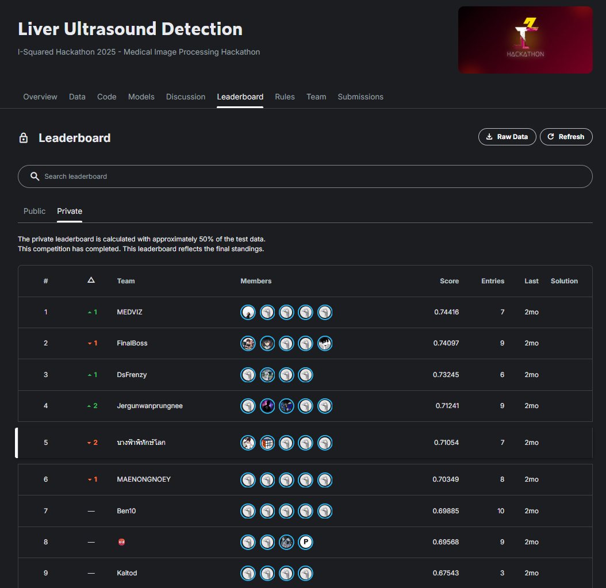

# 🏆 Liver Ultrasound Detection - I-Squared Hackathon 2025

**Team Name:** Nangfa Phithak Lok (นางฟ้าพิทักษ์โลก)

> **5th Place Solution** for the I-Squared Medical Image Processing Hackathon 2025.  
> **Topic:** Liver Ultrasound Tumor Detection, Localization, and Classification.

---

## 🏅 Achievement

**Official Leaderboard Ranking: 5th Place**

*(Note: The competition page is private. Below is the snapshot of the final standings)*

---

## 📝 Abstract

This project develops a deep learning–based liver disease classification system using ultrasound images. We utilized **YOLO (You Only Look Once)** architecture to detect and classify seven distinct types of liver diseases: FFC, FFS, HCC, Cyst, Hemangioma, Dysplastic nodules, and CCA.

Our approach focuses on handling class imbalance through **Copy-Paste Augmentation** and improving model robustness during inference using **Test-Time Augmentation (TTA)**.

---

## 🎯 Objective

The primary objective is to develop an accurate **multi-class liver disease detection model** that can:
1.  **Detect** the presence of a tumor.
2.  **Localize** the tumor with a bounding box.
3.  **Classify** the tumor into the correct pathological category.

---

## 📊 Dataset Labels

**Note:** The dataset used in this competition is private and proprietary. **It cannot be shared, distributed, or uploaded publicly** according to the competition rules.

The dataset consists of ultrasound images categorized into 7 classes:

| ID | Label | Description |
| :---: | :--- | :--- |
| 0 | FFC | Focal Fatty Change |
| 1 | FFS | Focal Fatty Sparing |
| 2 | HCC | Hepatocellular Carcinoma |
| 3 | Cyst | Liver Cyst |
| 4 | Hemangioma | Hemangioma |
| 5 | Dysplastic | Dysplastic Nodule |
| 6 | CCA | Cholangiocarcinoma |

---

## ⚙️ Methodology

### 1. Model Selection: YOLO
We selected the YOLO architecture for the following advantages:
* **Ease of Use:** Streamlined implementation and training process.
* **Parameter Efficiency:** Large parameter options (e.g., YOLOv8x, YOLOv11x) reduce the risk of overfitting compared to some other architectures while maintaining high capacity.
* **Flexibility:** More configuration options for hyperparameters.
* **Performance:** Lower resource usage with excellent generalization capabilities.

### 2. Model Improvement Strategies

#### A. Copy-Paste Augmentation
* **Goal:** Increase data diversity for underrepresented classes (handling Class Imbalance).
* **Principle:** We extract object instances from rare classes and "paste" them onto new background images. This teaches the model to recognize these objects in varied contexts, scales, and backgrounds.

#### B. Test-Time Augmentation (TTA)
* **Goal:** Reduce prediction errors caused by unusual angles or object positions.
* **Principle:** During inference, the model predicts on multiple augmented versions (e.g., flipped, scaled) of the same image. The results are averaged to produce a more stable and accurate final prediction.

---

## 🧪 Experiments & Results

We conducted experiments using different YOLO versions and training strategies. Below are the results based on the validation set (**mAP50**).

| Model | Epochs | Configuration / Strategy | mAP50 Score | Note |
| :--- | :---: | :--- | :---: | :--- |
| **YOLO v11x** | **100** | **+ Test-Time Augmentation (TTA)** | **0.71054** | **Best Performance** |
| YOLO v11n | 60 | Base Training | 0.67055 | |
| YOLO v8x | 100 | `cls=2.0` loss weight + TTA | 0.70810 | |

---

## 🚀 Installation & Usage

### Prerequisites
* Python 3.8+
* PyTorch
* Ultralytics

## 👥 Team: Nangfa Phithak Lok

We are a team of developers and researchers participating in the I-Squared Hackathon.

* **Nontapat Auetongjit**
* **Member 2**
* **Vatanya Upalagama**
* **Vatanya Upalagama**
* **Vatanya Upalagama**

---

## 🙏 Acknowledgments & Sponsors

We would like to thank the organizers and sponsors for making this competition possible:

* **Google**
* **GULF**
* **Bright Hair Studio**

